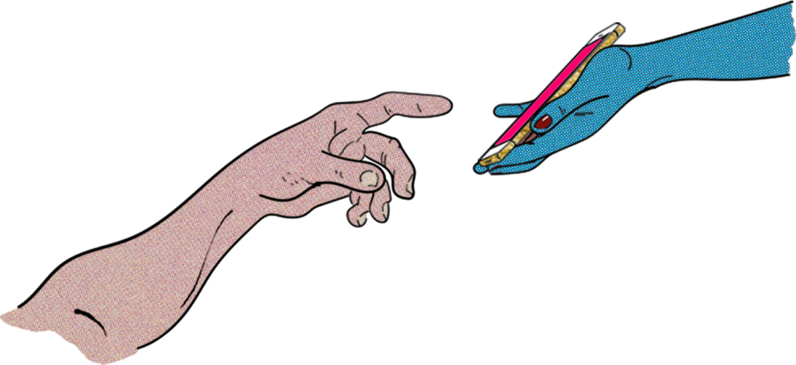

<!--
**wulfsounds/wulfsounds** is a ✨ _special_ ✨ repository because its `README.md` (this file) appears on your GitHub profile.

Here are some ideas to get you started:

- 🔭 I’m currently working on ...
- 🌱 I’m currently learning ...
- 👯 I’m looking to collaborate on ...
- 🤔 I’m looking for help with ...
- 💬 Ask me about ...
- 📫 How to reach me: ...
- 😄 Pronouns: ...
- ⚡ Fun fact: ...
-->

# Hi, I'm Dev!

I'm a graphic design enthusiest and aspiring web designer currently attending SMU Code Bootcamp to develop skills utilizing the MERN stack and mySQL. I’ve always had a passion for graphic and web design since Tom was my first MySpace friend. Over the years, I’ve made a lot of show flyers, album covers, church bulletins, posters, tanning salon signs, and hand-drawn logos but web development is a rediscovery for me. Through the course of the bootcamp, my goal is to gain enough knowledge to be dangerous enough to build websites and applications that standout from the rest. Thanks for hanging out!

# My Tech Stack

## Languages

## Technology

### Database

### Design

### Additional Technologies
Procreate, Insomnia

<!-- EDUCATION -->
<!-- CONTACT/LINKS -->
<!-- MUSIC INFORMATION -->
